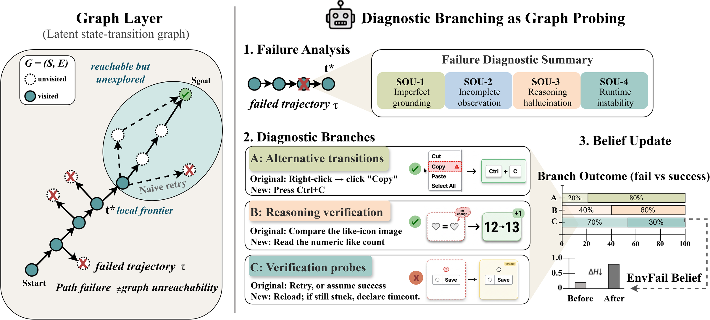

# DiagEval

[](LICENSE)

**DiagEval** is a diagnostic retry framework for automated GUI evaluation. Instead of blindly retrying failed test cases, DiagEval diagnoses the source of uncertainty (SOU), generates targeted diagnostic probes, and uses Bayesian belief updating to distinguish between agent failures and environment failures.



## Key Idea

When a GUI agent fails a test case, the failure can stem from:
- **Agent Failure**: The agent used a wrong strategy, missed UI elements, or hallucinated
- **Environment Failure**: The application itself has a bug or limitation

DiagEval performs **diagnostic retry** through a principled pipeline:

1. **Failure Diagnosis** — Classify the failure into a Source of Uncertainty (SOU) category
2. **Branch Generation** — Generate targeted diagnostic probes along three dimensions:
   - **Dim A**: Alternative transition probes (different interaction paths)
   - **Dim B**: Observation/reachability probes (broader exploration)
   - **Dim C**: Verification/contradiction probes (conservative validation)
3. **Branch Selection** — LLM judge scores candidates on root-cause fit, feasibility, non-repetition, and specificity
4. **Sequential Execution** — Execute selected branches with Bayesian posterior updates:
   - Success → Pass (existential proof)
   - Failure → Update P(EnvFail) using dimension-specific likelihood γ_d
5. **Stopping** — Early stop when P(EnvFail) exceeds threshold, or first success

## Installation

### Using pip

```bash
# Clone the repository
git clone https://github.com/<your-org>/DiagEval.git
cd DiagEval

# Create environment
conda create -n diageval python=3.10
conda activate diageval

# Install dependencies
pip install -r requirements.txt
pip install -e .

# (Optional) Install with OCR and icon detection
pip install -e .[ultra]
```

### Using Docker

```bash
docker build -t diageval -f Dockerfile .
docker run -it diageval
```

### Linux (Ubuntu 22.04) System Dependencies

```bash
sudo apt update
sudo apt install -y python3 python3-dev python3-tk python3-pip python3-venv \
    python3-pyatspi git gnome-screenshot xclip
```

## Quick Start

```bash
# 1. Configure API credentials
cp configs/config.yaml.example configs/config.yaml
# Edit configs/config.yaml with your API key

# 2. (Optional) Download model weights
bash scripts/download_data.sh

# 3. Run evaluation
python experiments/run_test.py --config configs/run_config.yaml
```

## Reproduce Paper Results

```bash
# Configure
cp configs/config.yaml.example configs/config.yaml
cp configs/run_config.yaml.example configs/run_config.yaml
# Edit both files with your settings

# Run main experiment (Table 1)
bash scripts/reproduce.sh
```

## Project Structure

```
DiagEval/
├── README.md                         # This file
├── LICENSE                           # MIT License
├── requirements.txt                  # Python dependencies
├── setup.py                          # Package installation
├── Dockerfile                        # Reproducible environment
│
├── appeval/                          # Core framework
│   ├── roles/
│   │   ├── eval_runner.py            # Pipeline orchestrator (Round 1 + Round 2)
│   │   ├── osagent.py                # VLM-based GUI agent
│   │   └── text_agent.py             # Text-only agent (DOM/a11y tree)
│   ├── judges/
│   │   └── supervisor_judge.py       # SOU classifier + branch scorer + Bayesian updater
│   ├── actions/
│   │   ├── case_generator.py         # LLM-based test case generation
│   │   ├── tell_verifier.py          # Post-action verification
│   │   ├── reflection.py             # Agent self-reflection
│   │   └── screen_info_extractor.py  # UI analysis
│   ├── prompts/                      # LLM prompt templates
│   ├── tools/                        # Chrome debugger, OCR, icon detection
│   └── utils/                        # Helpers
│
├── configs/                          # Configuration templates
│   ├── config.yaml.example           # LLM API credentials
│   └── run_config.yaml.example       # Experiment parameters
│
├── scripts/                          # Utility scripts
│   ├── reproduce.sh                  # One-click reproduction
│   └── download_data.sh              # Download data & model weights
│
├── experiments/                      # Experiment runners
│   ├── run_test.py                   # Main evaluation runner
│   └── run_tell_verifier_posthoc.py  # Post-hoc verification
│
├── data/                             # Data & model weights
│   └── example/                      # Example test cases
│
└── assets/
    └── images/                       # Documentation images
```

### Bayesian Parameters

| Dimension | γ_d | Interpretation |
|-----------|-----|----------------|
| Dim A (alternative paths) | 0.60 | SOU-1: Imperfect grounding |
| Dim B (observation probes) | 0.50 | SOU-2: Incomplete observation |
| Dim C (verification probes) | 0.40 | SOU-3: Reasoning hallucination |

Lower γ_d means a failure on that dimension provides **stronger evidence** for EnvFail.

### EIG-Based Branch Ordering

After selecting Top-K diagnostic branches, DiagEval re-orders them by **Expected Information Gain (EIG)** to maximize entropy reduction per probe:

$$\text{EIG}(d) = H(p) - \Big[ P_{\text{obs}}(\text{success}) \cdot H(p_{\text{succ}}) + P_{\text{obs}}(\text{fail}) \cdot H(p_{\text{fail}}^{(d)}) \Big]$$

where $H(p) = -p\log_2 p - (1{-}p)\log_2(1{-}p)$ is binary entropy, and:

- $p_{\text{fail}}^{(d)} = \frac{p}{p + (1-p)\gamma_d}$ — posterior after observing failure on dimension $d$
- $P_{\text{obs}}(\text{success}) = (1-p) \cdot w_d + p \cdot \frac{\beta}{\alpha+\beta}$ — marginal success probability

EIG naturally balances two goals: higher $w_d$ prioritizes branches likely to recover the task directly, while lower $\gamma_d$ prioritizes branches whose failure provides stronger diagnostic evidence.

## License

This project is distributed under the MIT License. See [LICENSE](LICENSE) for details.
